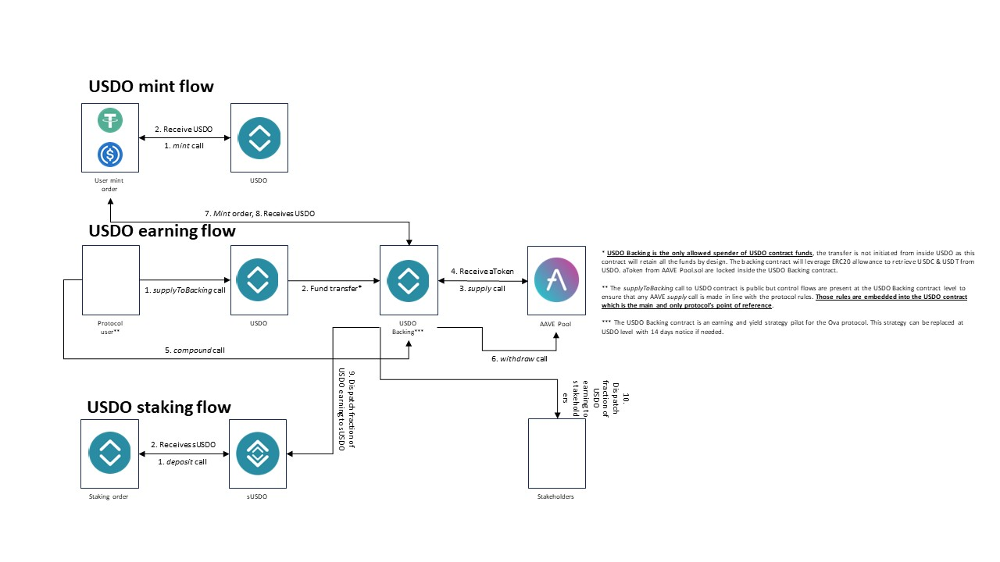
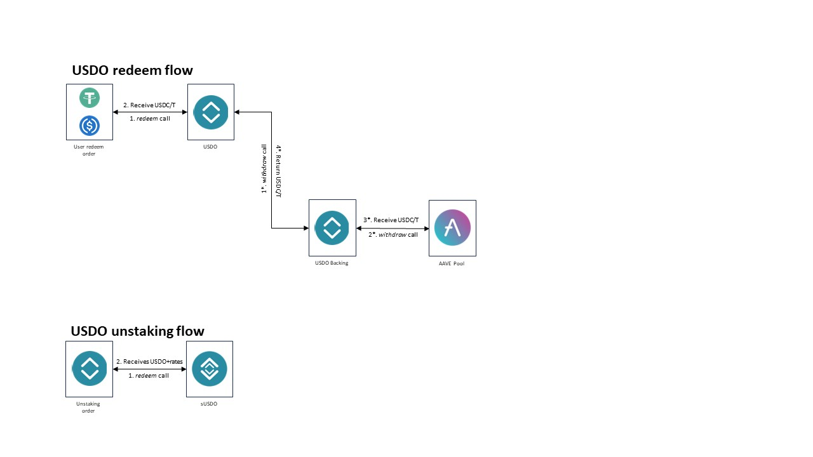

# contracts

[](https://github.com/Ovafi/contracts/actions)

Yield generating USDC/T backed stable coin.

## Overview



## Node version required
```
>= 18.x.x
```

## To install
```
npm i
```

## To compile
```
npm run compile
```

## Run tests
```
npm run unit
```
Unit tests must be run on a forked version of Ethereum mainnet (see next point).
Sometimes the private rpc (which the next point is based on) will have issue with `maxFeePerGas` limits. For now running the suite another time should solve the issue.

## Run test node
```
npm run node
```
This will spawn a forked Ethereum mainnet from block `21795000`

## Run script/deployment
```
npm run exec-[network: local/ova/eth...] YOUR_SCRIPT
```

## Run `solhint`
```
solhint contracts/**/*.sol
```

## `slither`
Static code analyzer can be installed by following [slither guide](https://github.com/crytic/slither).
From repository root:
```
slither --include-paths contracts/ .
```

## Run `prettier`
```
npm run prettier-ts
npm run prettier-sol
```

## Internal beta RPC
Ova has an internal RPC with a copy of Ethereum mainnet starting from block `19709557`
