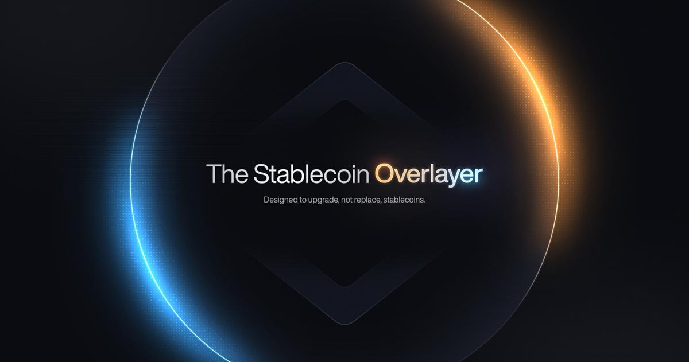
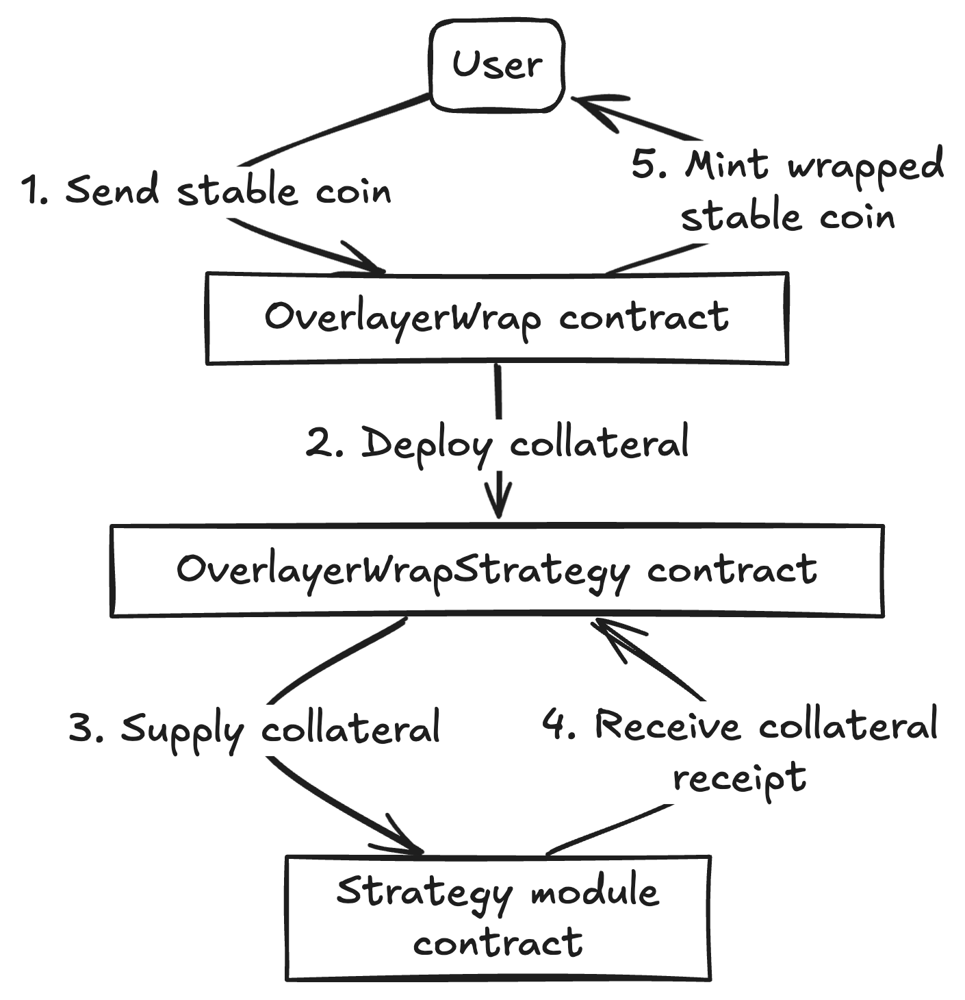
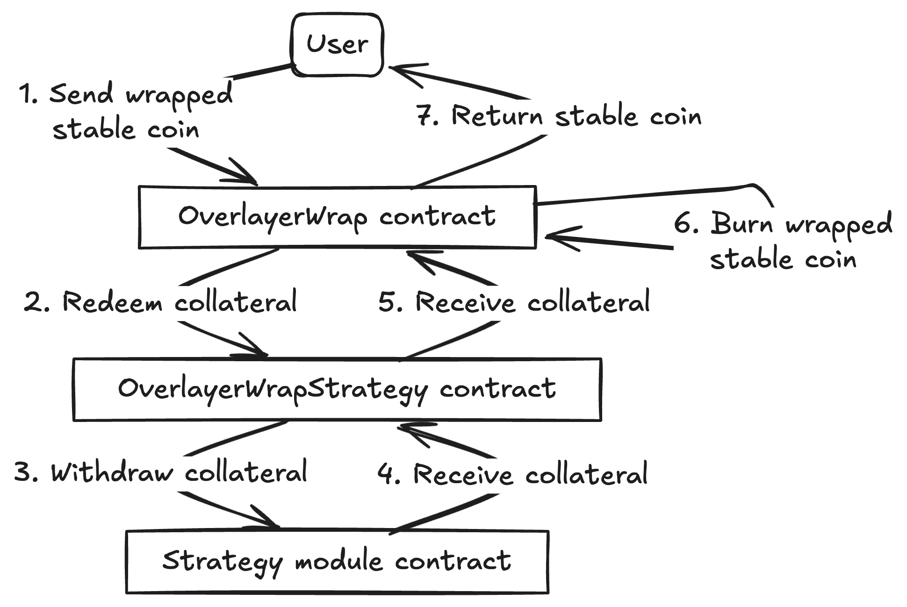
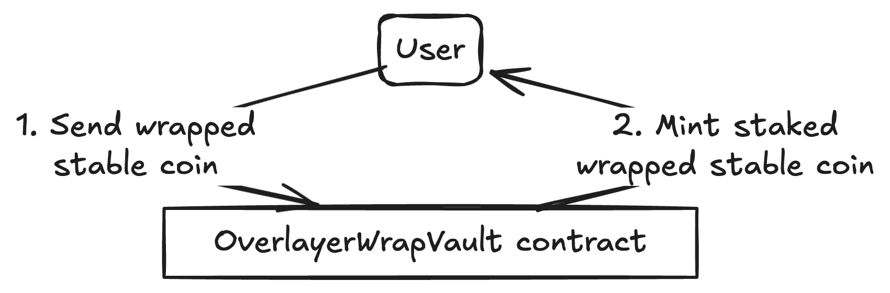
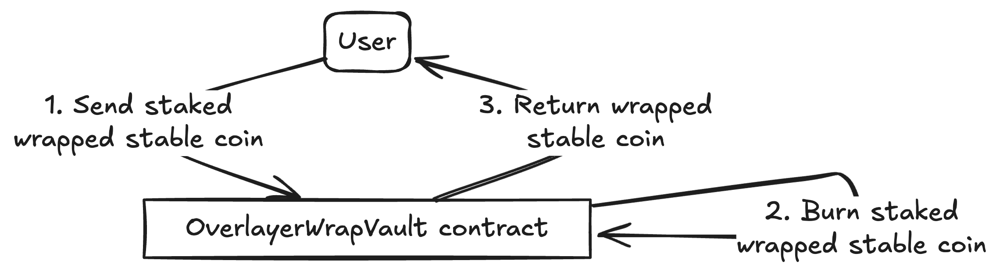
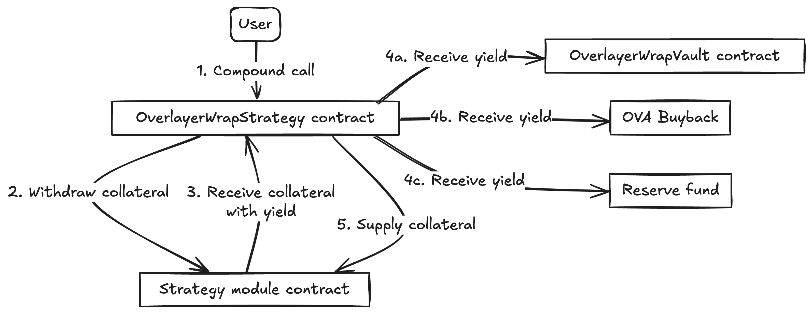

<p align="center">
  <a href="https://docs.ova.finance/" rel="noopener" target="_blank"></a>
</p>

# Overlayer smart contracts

[](https://github.com/Ovafi/contracts/actions)

The stable coin [Overlayer](https://docs.ova.finance/).


## Overview

### Mint

Minting allows users to convert their stablecoins (like USDT) into the Overlayed asset. This process involves depositing the stablecoin into the contract, which in turn mints the Overlayed token for the user.



### Redeem

Unwrapping is the reverse of wrapping. Users can redeem their underlying by burning the Overlayed token.



### Stake

Staking transforms the Overlayed asset into an interest-bearing asset, the sToken. Users deposit their Overlayed token into the staking contract and receive sTokens in return, which accrue interest.



### Unstake

Unstaking allows users to redeem their sTokens to get back the Overlayed asset, including any interest that has been accrued.



### Compound

Compounding involves claiming the earned rewards and re-staking them to maximize returns. The Overlayer protocol may offer a compounding feature that automatically claims rewards and adds them to the staked position, thus increasing the user's share and future earnings.




## Development Setup

### Node version required

```
>= 18.x.x
```

### Install

```
npm i --force
```

### Compile

```
npm run compile
```

### Run tests

```
npm run unit
```

Unit tests must be run on a forked version of Ethereum mainnet (see next point).

### Run test node

```
npm run node
```

This will spawn a forked Ethereum mainnet from block `21795000`

### Run script/deployment

```
npm run exec-[network: local/ova/eth...] YOUR_SCRIPT
```

### Run `solhint`

```
solhint contracts/**/*.sol
```

### `slither`

Static code analyzer can be installed by following [slither guide](https://github.com/crytic/slither).
From repository root:

```
slither --include-paths contracts/ .
```

### Run `prettier`

```
npm run prettier-ts
npm run prettier-sol
```

### Hardhat utils

#### Flatten

```
npx hardhat flatten FILE.sol
```

#### Verify

```
npx hardhat verify --network NETWORK ADDRESS "ARG"
```


